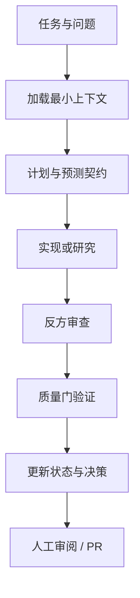

# DAO：AI 黄金趋势认知系统

DAO（道）是一个面向黄金市场的 AI 趋势认知项目。它把中国传统思想中的“观变、审时、度势”转译为可定义、可验证、可校准的软件模型，并用概率预测、金融数据与多 Agent 协作持续修正判断。

它不回答“明天黄金一定涨还是跌”，而回答：

- 当前市场处于什么状态？
- 哪些力量正在主导市场？
- 趋势处于形成、扩张、衰竭还是转换阶段？
- 哪些证据支持或反对当前判断？
- 什么条件出现时，当前判断必须失效？
- 当前更适合观察、等待、试探还是回避？

> 本项目用于研究与决策辅助，不提供确定性价格预测，不构成投资建议，也不直接执行交易。

## 当前阶段

仓库目前处于 `runtime-readiness` 阶段：研究、认知和评估契约已经形成，标准 Schema、跨文件硬门、OANDA XAU/USD 私有准备器、Kaggle GC 自动准备器、Feature/Baseline 冻结已经落地。当前重心是在数据权利人的本地环境执行真实、可回放的认知帧，而不是建设前端或自动交易代码。

核心研究报告：

- [《从易经“观变”到 AI 黄金趋势智能系统》](docs/research/system-design.md)
- [产品需求文档 v0.2](docs/product/prd-v0.2.md)
- [AI 趋势认知规格 v0.1](docs/product/trend-cognition-spec-v0.1.md)
- [评估契约 v0.3](evals/evaluation-contract-v0.3.md)
- [数据源资格矩阵 v0.2](docs/data/data-source-qualification-matrix-v0.2.md)
- [每日运行手册](docs/harness/DAILY_RUNBOOK.md)

## Harness 如何工作

本项目把上下文、约束、状态和验收标准都保存在仓库中，使 Codex、Claude Code、GitHub Copilot 或人类协作者可以在不同会话中稳定接续工作。



关键入口：

| 文件 | 用途 |
|---|---|
| [AGENTS.md](AGENTS.md) | 所有 Agent 的唯一主规范 |
| [harness.yaml](harness.yaml) | 工程清单、阶段和验证命令 |
| [上下文地图](docs/harness/CONTEXT_MAP.md) | 按任务类型加载最小上下文 |
| [工作流](docs/harness/WORKFLOW.md) | 从立项到提交的标准循环 |
| [质量门](docs/harness/QUALITY_GATES.md) | 研究、数据、模型和输出的验收标准 |
| [每日运行手册](docs/harness/DAILY_RUNBOOK.md) | 让 AI 读取 Harness 并执行一次认知运行 |
| [每日运行 Prompt](prompts/daily-cognition-run-v0.3.md) | AI 的固定执行协议 |
| [项目状态](state/PROJECT_STATE.md) | 当前进展、下一步与阻塞项 |
| [任务模板](tasks/TEMPLATE.md) | 每项工作的范围与完成定义 |

## 目录结构

```text
.
├── AGENTS.md
├── CLAUDE.md
├── harness.yaml
├── docs/
│   ├── architecture/     # 领域本体与 Agent 协议
│   ├── decisions/        # 不可轻易覆盖的架构决策
│   ├── harness/          # 工作流、上下文与质量门
│   ├── product/          # 产品目标与边界
│   └── research/         # 研究报告与研究记录
├── evals/                # 预测与系统评估规范
├── examples/             # 安全边界与运行样例
├── prompts/              # 可重复调用的 AI 运行协议
├── schemas/              # 机器可验证的数据契约
├── scripts/              # Harness 校验工具
├── state/                # 跨会话项目记忆
├── tasks/                # 一次一个主题的任务记录
└── templates/            # 研究、预测与认知帧模板
```

## 开始一次工作

1. 阅读 `AGENTS.md` 和 `state/PROJECT_STATE.md`。
2. 根据 `docs/harness/CONTEXT_MAP.md` 只加载本任务需要的文档。
3. 从 `tasks/TEMPLATE.md` 建立一个任务文件，先写清目标、非目标和完成定义。
4. 研究或实现后运行：

```bash
make validate
```

5. 更新项目状态、决策日志和任务结果，再提交一个主题明确的 PR。

## 执行一次黄金趋势认知

1. 在许可人的本地环境安装运行包并填写一次性许可声明；`prepare-*` 会从白名单官方 HTTPS 地址自动下载三类宏观/事件快照到 gitignored private root。
2. XAU/USD 使用 `prepare-oanda`（API 凭据只放在本地环境）。GC 使用 `prepare-gc`：唯一数据源是 Kaggle 数据集 `youneseloiarm/comex-gold-futures-dataset-gc-contract`，由官方 `kaggle` CLI 自动下载（`python -m pip install -e '.[kaggle]'` 安装、`kaggle auth login` 认证），daily-only、主参考价格为数据集 `Close`（非 CME 官方 settlement）、资格为 exploratory/Q0。所有下载文件只保存在 gitignored private root。
3. 用 `validate-bundle --private-root ...` 验证 Schema、时间、概率、引用和真实文件哈希。
4. 执行 `generate-baseline-forecast --run-dir ...` 生成冻结基线 Forecast Contract，再让本地 AI 读取 `AGENTS.md` 与 `prompts/daily-cognition-run-v0.3.md`，补充 Evidence、MCF 与解释。
5. completed run 必须再次通过同一 bundle 校验；任一核心门失败时输出 blocked/Q0 并预测弃权。

可直接复制的完整调用方式见[每日运行手册](docs/harness/DAILY_RUNBOOK.md)。

## 核心约束

- 传统思想提供问题框架与命名，不进入未经验证的概率引擎。
- 每个市场判断都必须带 `as_of`、`data_cutoff`、证据、概率、反方情景和失效条件。
- LLM 组织证据与解释，不虚构行情，不替代数值模型计算概率。
- 训练、回测和评估必须使用当时可获得的数据，防止前视偏差。
- 没有优势或证据冲突过大时，系统必须能够弃权。

## 下一里程碑

双研究轨的软件运行层已经形成。下一步由数据权利人在本地执行 `prepare-oanda`（XAU/USD certified）或 `prepare-gc`（Kaggle GC，automated/exploratory）；运行器会自动下载允许的官方快照并执行 `validate-bundle`，再由本地 AI 生成对应轨道的首份真实认知帧。具体见[数据源矩阵](docs/data/data-source-qualification-matrix-v0.2.md)、[每日运行手册](docs/harness/DAILY_RUNBOOK.md)与[项目状态](state/PROJECT_STATE.md)。
