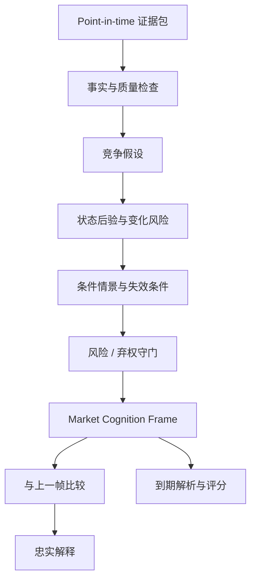

# DAO 产品需求文档 v0.1：AI 趋势认知研究闭环

- 状态：Accepted for research
- 日期：2026-07-29
- 阶段：Cognition Design → Evaluation Design
- 关联决策：[ADR-0002：以趋势认知为核心产品](../decisions/ADR-0002-cognition-first.md)

## 1. 产品命题

DAO 不是回答“黄金接下来一定涨还是跌”，而是维护一份随时间演化的市场认知：

> 在给定 `as_of` 与 `data_cutoff` 下，当前市场是什么状态，哪些力量正在主导，状态如何可能变化，什么新证据会使判断失效，以及系统对这些判断有多大把握。

第一阶段要验证的不是软件平台能否运行，而是 AI 能否持续生成**有依据、可证伪、可修正、可评分**的趋势认知。

## 2. 第一位用户

第一位用户是项目内部的趋势研究者，而不是直接面向外部的交易客户。

用户需要反复形成 XAU/USD 观点，但希望避免：

- 每次分析都从零开始。
- 被最新一根 K 线或单条新闻带偏。
- 只记录结论，不记录当时证据和判断条件。
- 事后用新信息改写旧观点。
- 把语言流畅误认为预测可靠。

## 3. 首要使用场景

### 3.1 每日离线认知帧

- 标的：`XAU/USD`
- 观察尺度：日线为主，4 小时用于观察形成与转换
- 首要预测尺度：未来 3—5 个交易日
- 辅助尺度：未来 1 个交易日与 2—4 周背景
- 生成频率：每天一个固定 `data_cutoff`
- 输出方式：结构化认知帧 + 忠实解释

事件前后更新、盘中连续更新和外部用户页面属于后续阶段。

### 3.2 用户要完成的工作

用户在一次会话中应能：

1. 看见当前状态，而不是先读一篇长报告。
2. 知道相比上一帧发生了什么变化。
3. 检查主要证据、反方证据和数据缺口。
4. 比较至少两个互斥情景及其触发条件。
5. 知道何时必须重新评估或弃权。
6. 在预测到期后回看当时判断并评分。

## 4. 什么叫“AI 理解了趋势”

“理解”不是单一标签，而是一组可观察能力。

| 能力 | 系统必须回答 | 不合格表现 |
|---|---|---|
| 观察 | 当时可见的事实是什么？ | 混入事后数据或无来源事实 |
| 表征 | 方向、生命周期和稳定性是什么？ | 只给“看涨/看跌” |
| 解释 | 哪些独立力量支持或反对当前状态？ | 把指标罗列当作因果解释 |
| 推演 | 条件不变或触发条件出现时，可能怎样演化？ | 给单一路径或确定性结论 |
| 修正 | 新证据使哪些信念发生了什么变化？ | 直接改结论，不解释变化 |
| 自知 | 哪些信息缺失，何时应弃权？ | 在任何环境下都强行输出方向 |

第一阶段的目标是达到“条件化趋势推理”，并建立可审计的观点修正能力。能力分级和测试见[趋势认知规格 v0.1](trend-cognition-spec-v0.1.md)。

## 5. 核心认知对象

### 5.1 Evidence Snapshot

冻结在 `data_cutoff` 前已可获得的事实、数据版本和来源。它回答“AI 当时究竟知道什么”。

### 5.2 Competing Hypotheses

同一证据至少允许两种可区分解释。例如，“上涨趋势延续”与“上涨已进入脆弱成熟期”不能被合并成模糊叙事。

### 5.3 Market Cognition Frame

每个认知帧至少包含：

- 状态：方向、生命周期、稳定性与后验概率
- 观变编码：形、势、机、时、位、信
- 支持证据与反方证据
- 互斥情景、概率和触发器
- 失效条件、数据缺口、风险与弃权状态
- 数据、特征、模型、Prompt 和契约版本

结构以 `schemas/market-cognition-frame.schema.json` 为准。

### 5.4 Cognition Delta

系统必须比较当前帧与上一帧，明确：

- 新增、失效或被修订的证据
- 状态后验的变化
- 生命周期或稳定性的迁移
- 情景概率的变化及原因
- 新增或解除的失效条件
- 是否从判断转为弃权，或从弃权恢复

`Cognition Delta` 是 v0.1 必需的产品输出，但其独立 schema 留给后续契约任务定义。

### 5.5 Resolution Record

预测到期后只追加结果和评分，不修改原始认知帧。结果解析必须使用预先登记的规则。

## 6. 认知生成流程

LLM 可以组织竞争假设、寻找冲突和生成解释，但不得自行补行情、修改程序计算的概率或绕过弃权结论。

## 7. 最小用户输出

v0.1 只定义一个“认知工作台”输出，不实现正式前端。

| 区域 | 用户看到什么 | 目的 |
|---|---|---|
| 当前认知 | 状态三轴、时间尺度、信度、数据截止时间 | 快速建立整体判断 |
| 发生了什么变化 | 与上一帧的 Cognition Delta | 防止结论漂移 |
| 为什么 | 支持证据、反方证据、独立性与新鲜度 | 检查依据 |
| 接下来可能怎样 | 互斥情景、概率、触发器 | 进行条件化推演 |
| 何时失效 | 失效条件、数据缺口、弃权状态 | 管理不确定性 |
| 以后如何验证 | 解析规则、到期时间、基线 | 保证可评分 |

面向用户的措辞使用“研究状态”或“需要重新评估”，不展示入场、止损、止盈、仓位和个性化动作。

## 8. 功能需求

### P0：认知闭环

- 从冻结的 point-in-time 证据包生成一个认知帧。
- 所有关键结论引用具体证据；反方证据不可隐藏。
- 情景互斥、尽量完备，概率和为 1。
- 每个预测问题都有明确 horizon 与 resolution rule。
- 每个认知帧都能与上一帧生成 Cognition Delta。
- 信息不足或模型冲突过大时可以 `abstain`。
- 原始认知帧不可被事后覆盖，只能追加新版本和解析记录。
- 复杂方法与朴素基线使用同一批样本评分。

### P1：认知增强

- 支持事件前后认知帧。
- 支持不同模型或 Agent 的竞争假设与分歧记录。
- 支持错误类型归因和概率校准报告。
- 支持按状态、生命周期和事件类型检索历史相似帧。

### P2：产品化

- 盘中更新、通知和外部用户界面。
- 经许可的数据源自动接入。
- 面向团队的审阅、批注和版本协作。

## 9. 非功能要求

- **时间完整性**：历史回放不得使用当时尚不可获得的数据。
- **可复现性**：输入快照和版本一致时，数值结果应可重复生成。
- **忠实性**：解释中的状态、数字和条件必须与结构化帧一致。
- **可审计性**：任何观点变化可追溯到证据、规则或版本变化。
- **克制性**：系统不因追求覆盖率而取消弃权。
- **可替换性**：传统概念映射、模型或 Agent 不优于基线时可以删除。

## 10. 评估与成功标准

### 10.1 M1 研究门槛

先制作 20—30 个覆盖不同状态的人工金标准样本。该规模用于验证任务定义和错误分类，不足以宣称稳定预测优势。

M1 通过条件：

- 每个样本都能按 `data_cutoff` 重建当时证据。
- 每个预测都可按预注册规则解析。
- 结构化帧与解释中的数字、状态和条件完全一致。
- 人工审阅中不存在无来源的新事实。
- 支持证据与反方证据都能被定位。
- 系统与所有朴素基线使用相同样本得到评分。
- 标签分歧、弃权原因和失败类型被完整记录。

### 10.2 后续量化指标

- 概率：Brier score、log loss、calibration curve、相对基线 skill score
- 状态：混淆矩阵、状态跳变率、生命周期一致性
- 转换：变化点检测延迟、虚警率与漏报率
- 修正：观点变化是否由新增证据支持、概率调整是否方向一致
- 弃权：覆盖率、弃权率、选择性风险
- 解释：证据覆盖率、无来源事实率、数值忠实度

短期盈亏不是 v0.1 的主要成功指标。

## 11. 首批金标准样本设计

20—30 个样本需要有目的地覆盖：

- 上升/下降趋势的形成与扩张
- 区间与假突破
- 成熟、衰竭和高脆弱状态
- 宏观事件前后发生的状态转换
- 价格与美元/实际利率信号冲突
- 数据缺失、模型冲突或极端波动下的弃权

样本不得只挑“事后看起来明显”的行情。标注者先看到 point-in-time 证据包并生成认知帧，之后才能打开未来结果。

## 12. 边界

v0.1 不做：

- 自动交易、经纪商连接或收益承诺
- 入场、止损、止盈和仓位推荐
- 分钟级预测与高频基础设施
- 正式前端和复杂多 Agent 平台
- 用卦象或术数生成信号
- 在 20—30 个样本上宣称模型已获得稳定优势

## 13. 待后续任务解决

1. `Cognition Delta` 的字段和 schema。
2. `risk.allowed_actions` 已在评估契约 v0.2 中重命名为 `risk.research_posture`。
3. 状态标签的人工标注指南与分歧处理。
4. 3—5 日情景的精确 resolution rule。
5. 第一批数据源的许可、时滞和 point-in-time 可得性。
6. 状态与情景概率的朴素基线。
