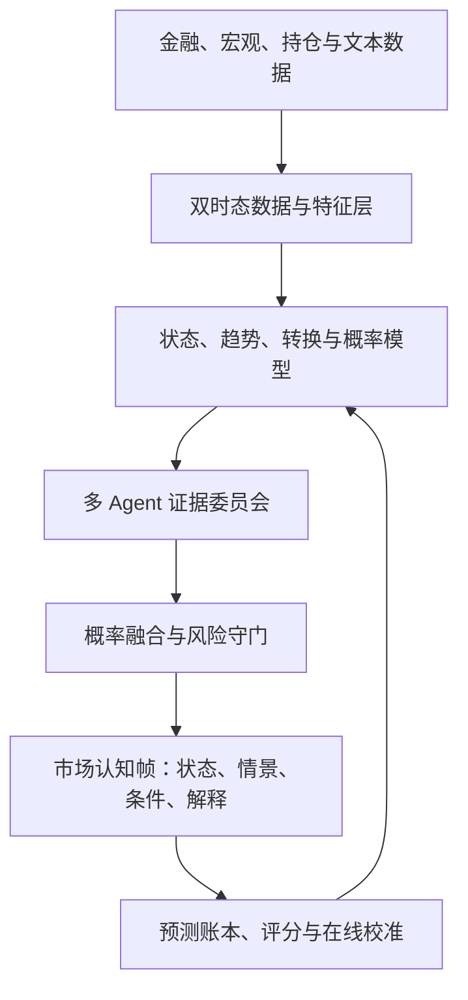

# 《从易经“观变”到 AI 黄金趋势智能系统》

## 摘要

黄金市场并不是一个能够通过单一指标稳定预测的机械系统。价格同时受到美元、实际利率、通胀预期、央行购金、ETF资金流、期货持仓、避险情绪、流动性以及市场自身趋势结构的影响，而且不同因素的重要性会随市场阶段改变。例如，实际利率长期以来是黄金的重要解释因素，但近年来其影响也可能被央行购金、财政风险和避险需求抵消，说明市场驱动关系本身也存在“状态转换”。

因此，本系统不以“预测明日收盘价”为目标，而以五个问题为核心：

1. 当前市场处于什么状态？
2. 推动市场运行的主要力量是什么？
3. 当前趋势位于生命周期的什么位置？
4. 哪些条件意味着原判断正在失效？
5. 在当前不确定性下，应该观察、等待、试探还是回避？

系统的基本范式是：

> **形是已经发生的结构，势是结构继续演化的倾向，机是状态转换的窗口，时是所处周期，位是当前阶段。**

中国传统思想负责提供“观察变化和审时度势”的认知框架；现代概率模型、时间序列模型和金融数据负责产生可验证结论；AI Agent负责组织证据、比较观点、发现冲突和生成解释。

---

## 研究方法、证据层级与边界

本报告采用三层证据结构：

1. **经典原文与哲学研究**：用于确认“变、时、位、势、虚实”等概念的思想来源；
2. **现代论文与教材**：用于支持概率评分、状态转换、趋势、变化点和Agent方法；
3. **官方或一手数据源**：用于界定系统实际能够获取的数据、频率、时滞和许可条件。

其中需要严格区分：

* “《易经》启发状态转换模型”是**方法论类比**，不是《易经》已经提出了现代统计模型；
* “临界减速可能提示脆弱性”是**候选特征假设**，不是已经证明能预测黄金转折；
* “趋势在历史样本中存在”是**经验事实**，不是任何时期都有效的自然定律；相关研究本身也存在复核与争议；[^tsmom][^tsmom-critique]
* World Gold Council属于行业研究与数据来源，CME、ICE等数据受商业许可约束；生产系统必须进行来源交叉验证与合规审查；
* 本报告是系统研究与产品架构，不构成投资建议，也不承诺预测或交易收益。

所有工程映射都必须经过明确定义、样本外验证、概率校准和基准对比。不能被检验的传统内容，只能进入命名、交互或文化解释层，不能进入核心概率引擎。

---

# 第一阶段：东方预测思想体系——道

## 一、《易经》：不是结果预测，而是状态与变化模型

《周易》的核心价值不在于给市场贴上某个卦名，而在于它把世界理解为一个不断变化的过程。《系辞》将阴阳爻之间的相互替换视为变化发生的基础；八卦、六十四卦及其顺序，则构成了一种由状态、关系和转换组成的认知结构。现代研究也通常把《易经》理解为一种连续、整体而动态的变化哲学。[^yijing-sep][^xici]

### 1. 阴阳：相反力量，而不是简单涨跌

不应直接规定：

* 阳等于上涨；
* 阴等于下跌。

在黄金市场中，风险厌恶通常属于“收缩性力量”，却可能推动避险买盘上涨；通胀上升可能利多黄金，也可能通过加息预期和实际利率上升压制黄金。

因此，阴阳更适合被工程化为：

* 正向压力与负向压力；
* 扩张力量与收缩力量；
* 主导力量与反作用力；
* 趋势持续力量与趋势瓦解力量。

对于每一个市场因素，分别记录：

$$
F_i(t) \in [-1,1]
$$

* 接近 +1：该因素强烈支持黄金上涨；
* 接近 -1：该因素强烈支持黄金下跌；
* 接近 0：影响中性、相互抵消或不明确。

阴阳不是固定属性，而是相对于具体对象、时间尺度和市场环境而言。

### 2. 八卦：基础变化模式

八卦可以被抽象为八类基础动力模式，而不是八种行情预测：

| 抽象模式 | 市场表达          |
| ---- | ------------- |
| 启动   | 突破、事件冲击、新趋势开始 |
| 延续   | 趋势稳定扩张        |
| 渗透   | 宏观因素逐渐影响价格    |
| 震荡   | 高频冲突、波动上升     |
| 阻滞   | 趋势受阻、关键位置反复   |
| 聚集   | 仓位、成交量或情绪集中   |
| 消散   | 动能下降、波动收缩     |
| 转化   | 原有关系失效、状态切换   |

这八类模式可以成为产品语言和状态标签，但不应直接成为量化模型的类别上限。

> 说明：上表是本报告提出的现代工程分类，并非对传统八卦含义的逐项翻译。八卦提供的是“用有限符号表达关系与变化”的结构启发，而不是八个可直接回测的金融因子。

### 3. 六十四卦：复合状态空间

六十四卦最有价值的启发是：

> 复杂状态可以由多个简单维度组合形成。

现代系统不必真的建立六十四种行情，而可以建立“六维市场编码”：

1. 微观价格行为；
2. 日内趋势结构；
3. 中期趋势结构；
4. 宏观环境；
5. 资金与持仓；
6. 事件与尾部风险。

每一维都包含：

* 方向；
* 强度；
* 变化速度；
* 置信度；
* 是否接近转换阈值。

由此形成一个持续变化的市场状态向量，而不是固定卦象。

### 4. 爻变：状态转移信号

“爻变”最适合对应现代系统中的：

* 变化点检测；
* 趋势斜率反转；
* 波动率结构变化；
* 相关性突然失效；
* 成交量和持仓异常；
* 宏观叙事切换；
* 模型后验概率快速变化。

设某维状态为 (x_i(t))，可以定义“变爻强度”：

$$
Change_i(t)=
a|\Delta x_i|+
b|\Delta^2x_i|+
cP(\text{regime change}\mid D_t)
$$

只有当变化速度、加速度或状态转换概率达到阈值时，系统才标记该维“正在发生变化”。

### 5. 时位：相同信号在不同阶段意义不同

“时位”是《易经》对金融系统最重要的启发之一。

同样一次上涨：

* 发生在长期震荡之后，可能是趋势启动；
* 发生在趋势中段，可能是正常扩张；
* 发生在极端拥挤之后，可能是最后加速；
* 发生在重大数据公布前，可能只是仓位调整。

因此，所有信号都必须加入三个上下文：

$$
Meaning = f(Signal,\ Horizon,\ LifecyclePosition)
$$

即：

* **时**：5分钟、4小时、日线还是月线；
* **位**：蓄势、启动、扩张、成熟还是衰竭；
* **势**：是否得到成交、持仓、宏观和跨市场信号支持。

### 6. “观其变”：系统持续更新，而非一次性结论

现代化表达是：

> 系统输出的不是永久观点，而是一个带时间戳、概率、证据和失效条件的暂时判断。

每一次数据更新都重新计算：

* 哪些证据增强了原判断；
* 哪些证据削弱了原判断；
* 哪些因素发生了反转；
* 是否需要切换市场状态。

### 结论

《易经》适合转化为：

* 市场状态空间；
* 多层级状态编码；
* 趋势生命周期；
* 状态转换模型；
* 条件化解释；
* 持续概率更新。

它不适合被直接转化为：

* 卦象买卖信号；
* 日期或点位预测；
* 缺乏样本外验证的神秘变量；
* 以六十四卦强行切割所有市场状态。

---

## 二、道家：顺应系统，而不是控制系统

道家把“道”理解为万物自身运行的过程，强调行动应适应事物的自然结构，而不是凭主观意志强行改变结果。《道德经》“道法自然”“反者道之动”的表述，可以分别启发自适应与反作用思维，但不能被当作市场反转定律。[^laozi]

### 1. 道法自然：尊重市场自身结构

软件含义：

* 不预设黄金必须与某个因素保持永久关系；
* 不因为模型过去有效，就认为未来仍然有效；
* 不要求模型在所有环境中都必须交易；
* 允许系统输出“不确定”“冲突”“暂不行动”。

这对应机器学习中的：

* 模型漂移检测；
* 自适应权重；
* 分市场状态建模；
* 弃权机制；
* 在线校准。

### 2. 顺势而为：趋势确认后参与

顺势不是追涨杀跌，而是：

* 先判断是否形成可持续结构；
* 再判断多个维度是否共振；
* 最后根据风险收益决定是否行动。

趋势跟踪研究表明，多个资产类别在部分中期尺度上曾表现出收益延续，但较长时期也可能出现反转，这正说明趋势必须结合持有周期和市场状态理解，而不能被视为永恒规律。

系统应把“顺势”表示为：

$$
TrendQuality =
Direction
\times Persistence
\times Participation
\times CrossFactorAlignment
$$

方向明确但成交不足、宏观背离或持仓极度拥挤，都不属于高质量趋势。

### 3. 物极必反：极端意味着脆弱，不等于立即反转

“物极必反”不能被简单写成超买即做空。

更科学的表达是：

> 当系统达到极端状态时，对扰动的敏感性可能上升，但转折时间仍然不确定。

极端状态可能继续维持，甚至进入加速阶段。因此系统应提高：

* 拥挤度分数；
* 脆弱性分数；
* 尾部风险；
* 止损敏感度；
* 反转观察优先级。

但只有价格结构、资金流或宏观驱动出现实际转变时，才确认反转。

### 4. 阴阳消长：不同力量的动态占比

市场不是“多头存在”或“空头存在”的二选一，而是两种力量比例不断变化。

系统可输出：

* 上行压力：63%；
* 下行压力：37%；
* 上行压力仍占优；
* 但过去两个观察周期下降了9个百分点；
* 市场进入“上行主导、优势收窄”状态。

### 5. 无为：没有优势时不行动

“无为”可以转化为系统中非常重要的决策状态：

* 证据冲突；
* 数据质量不足；
* 模型分歧过大；
* 重大事件即将发生；
* 潜在收益无法覆盖风险；
* 当前行情不属于模型能力范围。

因此，系统必须拥有第五种决策：

> **不做判断或不参与。**

这通常比强制输出多空方向更有价值。

---

## 三、《孙子兵法》：形、势、虚实与先胜后战

《孙子兵法》先比较条件、衡量力量，再决定是否进入行动。“先为不可胜，以待敌之可胜”“胜兵先胜而后求战”强调先建立不败条件，再等待优势出现；“兵势”讨论由组织和配置产生的效力，“虚实”强调避实击虚。[^sunzi-xing][^sunzi-shi][^sunzi-xushi]

### 1. 先胜后战：先证明优势，再考虑交易

金融系统中的“先胜”不是保证盈利，而是确认：

* 预期收益高于交易成本；
* 多个证据方向一致；
* 失效条件清晰；
* 最大损失可承受；
* 极端行情下仍能存活；
* 当前环境与模型适用范围一致。

系统首先回答：

> 现在是否具备值得承担风险的条件？

而不是首先回答：

> 现在应该做多还是做空？

### 2. 形：可观察的市场结构

“形”对应：

* 高低点结构；
* 均线排列；
* 支撑阻力；
* 成交量；
* 波动率；
* 期限结构；
* 期权偏度；
* 持仓结构。

“形”是已经出现、可以测量的事实。

### 3. 势：结构形成后的传播能力

“势”不是单个指标，而是结构继续自我强化的能力。本报告提出一个待估计的工程表达：

$$
\text{ShiScore}
=
\sigma\left(
w_1T+w_2P+w_3A+w_4R-w_5C-w_6F
\right)
$$

其中：

* \(T\)：趋势强度与持续性；
* \(P\)：成交、持仓和资金参与度；
* \(A\)：跨市场与多周期一致性；
* \(R\)：面对反向消息时的价格反应韧性；
* \(C\)：拥挤风险；
* \(F\)：结构脆弱性；
* \(\sigma\)：把结果映射到0—100的校准函数。

权重不能由哲学含义指定，而应按时间周期和市场状态，在滚动样本外数据中学习。若该分数不能改善概率校准或决策效用，就应删除，而不是为了保留“势”的叙事而保留指标。

高“势”行情具有以下特征：

* 价格持续创造新高或新低；
* 回撤后恢复较快；
* 成交与持仓支持趋势；
* 宏观因素方向一致；
* 突发利空或利多难以逆转趋势；
* 多个周期结构一致。

### 4. 虚实：表面价格与真实力量

应用示例：

| 市场现象             | 虚实判断             |
| ---------------- | ---------------- |
| 价格上涨但成交量下降       | 价格实、参与虚          |
| 突破新高但实际利率和美元同时走强 | 技术实、宏观虚          |
| 新闻极度利多但价格无法继续上涨  | 叙事实、承接虚          |
| 快速下跌后持仓未明显下降     | 价格弱、结构未必弱        |
| 大量空头拥挤但价格不再下跌    | 空头表面强、继续下跌空间可能变虚 |

### 5. 奇正：基础模型与事件模型

“正”可以对应：

* 趋势模型；
* 宏观模型；
* 波动率模型；
* 持仓模型；
* 常规风险控制。

“奇”可以对应：

* FOMC、CPI、非农等事件模型；
* 地缘冲突；
* 流动性冲击；
* 期权到期；
* 极端仓位挤压；
* 异常相关性变化。

系统平时以“正”为主，事件发生时动态启用“奇”，但事件 Agent 不得绕过风险控制。

### 6. 知彼知己

“知彼”：

* 市场主导资金是谁；
* 多空哪一方更拥挤；
* 哪些价格会触发止损或追单；
* 当前叙事是什么。

“知己”：

* 模型擅长什么环境；
* 模型在哪些环境容易失败；
* 用户能够承受多少损失；
* 当前数据是否充分；
* 系统概率是否经过校准。

---

## 四、其他传统体系的工程化价值

| 体系   | 可提炼的信息模型         | 工程价值 | 建议                |
| ---- | ---------------- | ---: | ----------------- |
| 太极思想 | 动态平衡、反馈、相反力量共存   |    高 | 作为系统总体世界观         |
| 六爻   | 多层级状态、位置关系、变化节点  |   较高 | 转化为六维状态编码         |
| 梅花易数 | 快速抽象、类比和情境映射     |   中低 | 可作为假设生成方式，不参与概率计算 |
| 奇门遁甲 | 时间、空间、角色、条件的矩阵组合 |   中低 | 可借鉴场景矩阵和决策路由      |
| 河图洛书 | 数字关系、对称、循环与空间组织  |    低 | 适合视觉化和文化表达        |
| 象数体系 | 用符号压缩复杂关系        |    中 | 可用于用户界面和状态语言      |
| 纳甲六爻 | 多因素映射和层级依赖       |  低至中 | 仅借鉴结构，不使用传统断验规则   |

### 判断标准

任何传统方法进入核心预测引擎前，必须满足：

1. 能定义明确输入；
2. 能定义可重复算法；
3. 能提供可证伪结果；
4. 能进行样本外测试；
5. 能与简单基准比较；
6. 能解释是否存在数据泄漏；
7. 能证明不是偶然拟合。

否则只能放在：

* 产品叙事层；
* 状态命名层；
* 可视化层；
* 认知启发层。

---

# 第二阶段：现代预测理论——术

## 一、概率预测：从结论转向信念分布

高质量预测不输出“必然”，而输出：

* 事件定义；
* 时间范围；
* 概率；
* 条件；
* 证据；
* 失效标准；
* 后续更新时间。

Superforecasting相关研究强调训练、协作、持续更新和预测聚合，并使用Brier Score等方式检验概率是否准确，而不是只统计方向对错。[^superforecasting] 严格适当评分规则之所以重要，是因为在理论上，它们能激励预测者诚实报告自身概率判断。[^proper-scoring]

### 系统中的概率对象

不要只计算：

$$
P(\text{上涨})
$$

而应计算竞争性状态：

$$
P(\text{趋势延续})
$$

$$
P(\text{进入震荡})
$$

$$
P(\text{趋势衰竭})
$$

$$
P(\text{反向转换})
$$

例如未来3至5个交易日：

* 上涨趋势延续：52%；
* 高位震荡：27%；
* 转入下跌：21%。

这种表达比“上涨概率73%”更接近真实决策环境。

### 贝叶斯更新

系统应维护先验判断：

$$
P(H)
$$

新数据到来后更新为：

$$
P(H\mid D)=P(D\mid H)\,P(H)/P(D)
$$

例如：

* 初始上涨延续概率：58%；
* CPI低于预期：上调至66%；
* 实际利率没有下降：回调至61%；
* 黄金突破关键阻力但成交不足：维持61%，同时提高脆弱性；
* 次日跌回突破位：下降至45%。

关键不是每次数据都改变方向，而是记录每条证据对后验概率的贡献。

### 预测账本

每次预测都要保存：

* 预测时间；
* 数据版本；
* 市场状态；
* 事件定义；
* 预测周期；
* 原始概率；
* 后续修订；
* 修订原因；
* 最终结果；
* Brier Score；
* 哪个Agent贡献最大；
* 哪个证据造成误判。

这是系统真正形成认知能力的基础。

### 可评分预测契约

概率必须对应可结算事件，不能只配一段模糊自然语言。例如：

```yaml
question: 未来5个交易日内，日线状态是否维持上行主导？
issued_at: 2026-07-29T12:00:00Z
resolve_at: 2026-08-05T21:00:00Z
outcomes:
  - trend_continuation
  - range_transition
  - bearish_transition
probabilities: [0.52, 0.27, 0.21]
resolution_rule: state_label_v1.3
data_cutoff: 2026-07-29T11:59:59Z
```

事件互斥且穷尽、结算时间固定、标签规则在预测前冻结，Brier Score和校准曲线才有意义。

---

## 二、金融市场趋势分析

### 1. 技术分析：作为传感器，不作为真理

可使用：

* 市场结构；
* 趋势斜率；
* 突破与失败突破；
* 多周期高低点；
* ATR；
* 成交量与持仓量；
* 波动率收缩和扩张；
* 动量；
* 均值偏离；
* 订单流。

但每个技术指标都只是一种特征，不允许单独给出最终判断。

### 2. 市场状态识别

Hamilton提出的Markov状态转换模型，将自回归参数视为离散状态Markov过程的结果，为经济和金融中的不可观测状态切换建模提供了重要基础。[^hamilton-regime]

系统可组合：

* Hidden Markov Model；
* Markov Switching Model；
* Hidden Semi-Markov Model；
* Bayesian Change Point Detection；
* 聚类；
* 动态因子模型；
* Transformer时序分类；
* 状态空间模型。

输出不是单一标签，而是后验分布：

* 趋势扩张：0.54；
* 成熟趋势：0.24；
* 转折过渡：0.17；
* 震荡：0.05。

### 3. 趋势跟踪

趋势模型应关注：

* 不同周期方向是否一致；
* 趋势持续时间；
* 突破后的接受程度；
* 回撤恢复速度；
* 波动调整后的动量；
* 参与度；
* 相关市场确认。

趋势延续不能仅通过均线交叉定义。

跨资产期货研究曾发现1—12个月尺度的时间序列动量，并观察到更长尺度上的部分反转；但后续复核对证据强度提出了质疑。[^tsmom][^tsmom-critique] 因此本系统把趋势跟踪作为需要持续复验的候选模型族，而不是先验真理。

### 4. 波动率

波动率模型应回答：

* 当前是低波动还是高波动；
* 波动正在收缩还是扩张；
* 实现波动率和隐含波动率是否背离；
* 事件前是否出现波动率压缩；
* 突破是否伴随波动率结构变化；
* 当前止损距离是否低于正常噪声范围。

### 5. 周期

系统至少区分：

* 5分钟至1小时：微观和日内周期；
* 4小时至3天：短线摆动周期；
* 3至15天：波段趋势；
* 1至6个月：宏观趋势。

不同周期可以同时处于不同状态：

> 月线偏多，日线成熟，4小时转弱，15分钟下跌扩张。

系统不能把它们压缩成一句“黄金看多”。

---

## 三、复杂系统理论

复杂系统的关键特征包括：

* 非线性；
* 反馈；
* 路径依赖；
* 多稳态；
* 突变；
* 小扰动引发大变化；
* 同一因素在不同状态中产生不同效果。

临界转变研究提出了方差上升、自相关增强和恢复速度变慢等潜在预警信号，但原研究同时明确讨论了误报、漏报、长样本需求和外部扰动变化等限制。[^critical-transition] 因此它们更适合成为待验证的“脆弱性指标”，不能单独成为黄金转折预测器。

### 可构建的临界状态指标

1. 一阶自相关持续上升；
2. 波动率持续增加；
3. 受到冲击后恢复时间变长；
4. 跨资产相关性突然集中；
5. 市场深度下降；
6. 买卖价差扩大；
7. 同类新闻带来的价格反应发生变化；
8. 原有驱动关系失效；
9. 模型分歧快速扩大。

定义：

$$
Fragility =
f(Autocorrelation,\ Variance,\ RecoveryTime,\ Liquidity,\ CorrelationShift)
$$

系统可以输出：

> 当前趋势仍然向上，但系统恢复能力下降，脆弱性由32升至68，进入“强趋势、高脆弱”状态。

---

## 四、AI Agent方法

ReAct将推理与外部动作交替进行，使模型能在外部观察反馈下更新计划；Reflexion则研究用语言反馈和情景记忆改进后续任务表现。[^react][^reflexion] 这些研究提供的是Agent设计模式，不等于多Agent在金融预测中天然优于单模型。系统仍须通过消融实验验证每个Agent的增量价值。

### LLM在系统中的正确角色

LLM适合：

* 阅读新闻和讲话；
* 提取事件与立场变化；
* 组织因果链；
* 对比不同Agent观点；
* 寻找证据冲突；
* 调用模型和数据库；
* 生成自然语言解释；
* 复盘预测错误。

LLM不适合直接：

* 凭语言感觉生成价格概率；
* 替代数值模型；
* 编造实时行情；
* 独立决定仓位；
* 在缺少证据时强制给出方向；
* 将相关性解释为因果关系。

核心原则是：

> **LLM负责形成假设和解释证据，统计模型负责产生和校准概率。**

---

# 第三阶段：核心书籍

## A. 东方预测思想

### 1. 《周易译注》

* 作者：黄寿祺、张善文
* 核心思想：系统呈现卦爻、象、时位和变化关系。
* 系统价值：建立状态、层级、位置和转换的东方认知框架。
* 阅读重点：系辞、说卦、序卦及乾坤两卦。
* 不建议：直接把卦辞转为交易规则。

### 2. The Classic of Changes

* 译注：Richard John Lynn
* 重点：王弼对《易经》的哲学解释。
* 核心价值：王弼强调透过具体象征把握抽象原则，而不是执着于符号字面。
* 软件启发：模型应从大量行情表象中提取少数潜在状态。

### 3. 《老子今注今译》

* 作者：陈鼓应
* 核心思想：自然、反转、柔弱、无为、循环。
* 系统价值：自适应、不过度交易、承认不确定性和模型边界。

### 4. Sun-Tzu: The Art of Warfare

* 译注：Roger T. Ames
* 核心思想：形、势、虚实、奇正、先胜后战。
* 系统价值：把市场分析从方向判断提升为条件判断和风险前置。

### 5. The Propensity of Things

* 作者：François Jullien
* 核心思想：研究中国思想中的“势”，即配置本身所产生的倾向和效力。
* 系统价值：帮助区分“价格已经上涨”和“市场具备继续上涨的结构力量”。

### 6. 《庄子今注今译》

* 作者：陈鼓应
* 核心思想：视角限制、认知边界、变化与适应。
* 系统价值：用于设计反方Agent、认知偏差检查和不确定性表达。

---

## B. 西方预测理论

### 1. Superforecasting

* 作者：Philip Tetlock、Dan Gardner
* 核心思想：问题拆解、基础概率、持续更新、概率校准、观点聚合。
* 软件模块：预测账本、Brier评分、概率更新、专家聚合。

### 2. Probabilistic Machine Learning: An Introduction

* 作者：Kevin P. Murphy
* 核心思想：以概率模型和贝叶斯决策理论统一机器学习。
* 软件模块：概率图模型、状态空间模型、后验推断、模型不确定性。

### 3. Forecasting: Principles and Practice

* 作者：Rob J. Hyndman、George Athanasopoulos
* 核心思想：时间序列分解、验证、残差诊断、基准比较。
* 软件模块：基准预测、滚动验证、预测区间、时间序列评估。

### 4. Time Series Analysis

* 作者：James D. Hamilton
* 核心思想：状态空间、非平稳过程、VAR、非线性和状态转换。
* 软件模块：宏观动态模型、Markov状态模型、跨资产关系。

### 5. The Signal and the Noise

* 作者：Nate Silver
* 核心思想：区分信号与噪声，重视基础概率和模型局限。
* 软件模块：噪声过滤、模型解释、用户认知教育。

### 6. Thinking in Bets

* 作者：Annie Duke
* 核心思想：决策质量与结果质量不同。
* 软件模块：决策日志、事后偏差控制、过程评分。

---

## C. 金融市场趋势研究

### 1. Following the Trend

* 作者：Andreas F. Clenow
* 场景：期货趋势跟踪、波动率调整、组合风险配置。
* 价值：理解趋势策略如何工程化，而不是依赖图形直觉。

### 2. Expected Returns

* 作者：Antti Ilmanen
* 场景：宏观因子、风险溢价、行为因素、反馈效应。
* 价值：建立黄金与跨资产因子的关系模型。

### 3. Evidence-Based Technical Analysis

* 作者：David Aronson
* 场景：检验技术分析规则是否存在统计意义。
* 价值：防止选择性回测和数据挖掘偏差。

### 4. Trading and Exchanges

* 作者：Larry Harris
* 场景：市场微观结构、订单、流动性、交易者行为。
* 价值：构建日内价格行为和流动性Agent。

### 5. Advances in Financial Machine Learning

* 作者：Marcos López de Prado
* 场景：金融机器学习、标签、交叉验证、样本权重。
* 价值：金融数据泄漏控制。
* 注意：其中方法仍需结合独立研究和基准模型验证。

### 6. Market Wizards

* 作者：Jack Schwager
* 场景：交易者决策、纪律、风险控制。
* 价值：构建用户行为与风险认知模块，而非提取固定策略。

---

## D. AI Agent与认知系统

### 1. Artificial Intelligence: A Modern Approach

* 作者：Stuart Russell、Peter Norvig
* 启发：Agent、搜索、概率推理、决策和多Agent系统的基础框架。

### 2. Multiagent Systems

* 作者：Yoav Shoham、Kevin Leyton-Brown
* 启发：不同信息、目标和角色的Agent如何协作或竞争。

### 3. AI Engineering

* 作者：Chip Huyen
* 启发：基础模型应用、评估、数据、维护和生产系统设计。

### 4. Designing Machine Learning Systems

* 作者：Chip Huyen
* 启发：数据漂移、监控、在线预测、反馈闭环。

### 5. Designing Data-Intensive Applications

* 作者：Martin Kleppmann
* 启发：流式数据、事件日志、一致性、存储与分布式处理。

### 6. Reinforcement Learning: An Introduction

* 作者：Richard Sutton、Andrew Barto
* 启发：状态、行动、奖励和长期反馈。
* 注意：初期系统不应直接使用强化学习控制真实仓位。

---

## 最值得深入研究的10本书及顺序

### 第一组：建立“道”

1. 《周易译注》
2. 《老子今注今译》
3. Sun-Tzu: The Art of Warfare
4. The Propensity of Things

目标：形成“变、时、位、势、虚实、等待条件”的认知框架。

### 第二组：建立概率与时间序列能力

5. Superforecasting
6. Forecasting: Principles and Practice
7. Probabilistic Machine Learning: An Introduction
8. Time Series Analysis

目标：把东方哲学转成概率、状态空间和状态转移模型。

### 第三组：进入金融与Agent工程

9. Expected Returns
10. AI Engineering

随后再延伸阅读：

* Following the Trend；
* Multiagent Systems；
* Designing Data-Intensive Applications。

---

# 第四阶段：AI黄金趋势分析系统架构

## 一、产品定义

产品不是：

* 自动喊单系统；
* 精确价格预测软件；
* 卦象交易软件；
* 单指标技术分析工具；
* 无条件运行的量化机器人。

产品是：

> **一个通过多维金融数据识别黄金市场状态，判断趋势阶段，计算情景概率，发现变化条件，并以可解释方式辅助用户决策的AI趋势认知系统。**

建议命名：

* GoldTrend Cognition；
* Gold Shi；
* 观势；
* 金势；
* ChangeScope Gold。

其中“势”是产品思想，“概率”是科学基础，“Agent”是认知组织方式。

---

## 二、总体架构：从事实流到认知帧



架构的关键不是Agent数量，而是三条边界：

1. **事实边界**：原始数据、派生特征、模型输出和LLM解释必须分别存储；
2. **时间边界**：任何判断只能使用其知识截止时间之前可获得的数据版本；
3. **权限边界**：风险守门可以否决行动性输出，LLM不能绕过概率模型或直接控制真实仓位。

---

## 三、核心理念层：形、势、机、时、位

### 1. 形

当前可直接观察的市场结构：

* 价格结构；
* 波动率；
* 成交量；
* 持仓；
* 期限结构；
* 关键位置；
* 相关资产表现。

### 2. 势

结构继续扩展的倾向：

* 趋势强度；
* 参与度；
* 持续性；
* 跨因素一致性；
* 市场对反向消息的抵抗能力。

### 3. 机

可能触发状态变化的条件：

* 突破或跌破；
* CPI、PCE、非农、FOMC；
* 实际利率快速变化；
* 美元突破；
* ETF资金流反转；
* 持仓极端；
* 波动率压缩后的扩张。

### 4. 时

所讨论的时间周期：

* 日内；
* 1至3天；
* 3至10天；
* 1至3个月。

### 5. 位

趋势生命周期位置：

* 蓄势；
* 启动；
* 扩张；
* 成熟；
* 衰竭；
* 转换。

---

## 四、现代市场状态模型

不要用一个标签概括市场，而采用三轴结构。

### 第一轴：方向

* 上行主导；
* 下行主导；
* 双方均衡；
* 方向不明。

### 第二轴：生命周期

1. **蓄势**：波动压缩，方向尚未确认；
2. **启动**：结构突破，驱动开始形成；
3. **扩张**：方向、参与度和波动共同增强；
4. **成熟**：趋势稳定，但边际加速下降；
5. **衰竭**：价格仍延续，内部力量开始减弱；
6. **转换**：原状态失效，新状态尚未稳定。

### 第三轴：稳定性

* 稳定；
* 脆弱；
* 临界；
* 高事件风险。

最终状态可以是：

> 上行主导 × 成熟阶段 × 脆弱性上升。

而不是简单“看涨”。

---

## 五、六维观变编码

建立六个类似“爻位”的市场层级，但不使用传统卦辞预测。

| 层级       | 数据             | 代表问题       |
| -------- | -------------- | ---------- |
| 第一层：微观行为 | Tick、盘口、成交、价差  | 短期买卖力量如何变化 |
| 第二层：日内结构 | 5m、15m、1h      | 日内趋势是否扩张   |
| 第三层：波段结构 | 4h、日线、周线       | 中期趋势位于什么阶段 |
| 第四层：宏观驱动 | 美元、利率、通胀、政策    | 外部环境支持哪种状态 |
| 第五层：资金结构 | ETF、CFTC、持仓、央行 | 谁在买卖，是否拥挤  |
| 第六层：事件风险 | 新闻、讲话、地缘、日历    | 是否可能触发突变   |

每层输出：

```text
direction: -1.0 ~ +1.0
strength: 0 ~ 100
change_speed: 0 ~ 100
confidence: 0 ~ 100
fragility: 0 ~ 100
evidence: [...]
```

当某一层发生显著变化时，标记为“变层”。

如果第四层宏观环境转弱、第五层资金流转弱，而价格层仍然上涨，系统输出：

> 价格趋势尚未反转，但两个上层驱动力已转弱，状态由“稳定扩张”变为“表强内弱”。

六维编码只是受“六爻分层”启发的现代信息架构。层数、字段和阈值必须由数据需求决定，不因传统体系使用六爻而获得正确性。

### 核心数据契约：Market Cognition Frame

每次完整推理只产生一个不可变、可版本化的“市场认知帧”：

```yaml
market: GC/XAUUSD
as_of: 2026-07-29T12:00:00Z
knowledge_cutoff: 2026-07-29T11:59:59Z
horizon: 3d-5d
state_posterior:
  trend_expansion: 0.48
  range: 0.34
  reversal: 0.18
lifecycle: mature
direction: upward_dominant
shi_score: 64
fragility_score: 57
regime_change_probability: 0.31
evidence_ids: []
counter_evidence_ids: []
invalidation_conditions: []
risk_gate: allow_with_limits
abstain: false
model_versions: {}
data_snapshot_id: snapshot_...
```

其中概率、分数与文字必须引用同一数据快照；任何后续修订都生成新版本，不覆盖旧判断。

---

## 六、认知模型层

### 1. 趋势识别模型

输入：

* 多周期OHLCV；
* ATR；
* 动量；
* 趋势斜率；
* 突破；
* 回撤；
* 成交量；
* 持仓量。

输出：

* 方向概率；
* 趋势强度；
* 延续概率；
* 结构失效位置；
* 周期一致性。

推荐组合：

* 规则基准模型；
* HMM或Markov Switching；
* Gradient Boosting；
* Temporal Convolution或Transformer；
* 模型集成。

### 2. 周期模型

输入：

* 多时间尺度收益；
* 波动率；
* 周期滤波结果；
* 宏观周期数据；
* 趋势持续时间。

输出：

* 当前主导周期；
* 不同周期是否共振；
* 趋势年龄；
* 可能的周期切换。

周期模型不能承诺固定周期重复，只能识别当前数据中的尺度结构。

### 3. 情绪模型

输入：

* 新闻；
* 社交媒体；
* 金融媒体标题；
* 期权偏度；
* ETF流量；
* 搜索热度；
* 市场评论。

输出：

* 黄金情绪方向；
* 情绪强度；
* 情绪变化速度；
* 叙事集中度；
* 情绪与价格是否背离。

关键指标：

> 利多新闻越来越多，但黄金上涨幅度越来越小。

这可能比新闻本身更有意义。

### 4. 宏观模型

输入：

* 美元指数；
* 名义美债收益率；
* 实际利率；
* 通胀预期；
* 联邦基金利率预期；
* CPI、PCE、非农；
* 财政风险；
* 地缘风险；
* 央行政策。

输出：

* 宏观黄金压力分数；
* 主导驱动；
* 驱动变化；
* 因子敏感度；
* 因子关系稳定性。

### 5. 风险模型

输入：

* 波动率；
* 流动性；
* 跳空风险；
* 事件日历；
* 相关性；
* 模型分歧；
* 用户风险预算。

输出：

* 风险等级；
* 正常噪声范围；
* 极端损失场景；
* 建议最大风险暴露；
* 是否禁止生成操作建议。

### 6. 临界转换模型

输入：

* 自相关；
* 方差；
* 恢复时间；
* 流动性；
* 相关性突变；
* 多模型分歧；
* 状态后验变化。

输出：

* 转换概率；
* 脆弱性；
* 预警原因；
* 需要确认的条件。

---

## 七、AI Agent架构

所有专业Agent必须返回统一证据包，而不是自由散文：

```yaml
claim: 实际利率变化正在削弱黄金上行动能
direction: bearish
horizon: 3d-5d
confidence: 0.66
evidence:
  - source_id: fred_dfii10_...
    observed_at: ...
    known_at: ...
counter_evidence: []
assumptions: []
data_freshness: current
model_version: macro_agent_1.4
```

概率融合只读取结构化字段；解释Agent可以生成文字，但不能修改上游数值。

### 1. 时势编排Agent

**职责：**

* 接收用户问题；
* 确定预测周期；
* 调度其他Agent；
* 防止跨周期混淆；
* 汇总结构化输出。

**输入：**

* 用户问题；
* 当前数据；
* 用户风险偏好；
* 分析周期。

**输出：**

* 分析任务图；
* Agent调用计划；
* 最终市场认知帧。

---

### 2. 趋势观察Agent

**职责：**

* 分析多周期价格结构；
* 判断高低点、突破、回撤和趋势阶段；
* 识别表面强弱与内部动能。

**输入：**

* OHLCV；
* 成交量；
* 持仓量；
* 技术特征。

**输出：**

* 各周期方向概率；
* 生命周期；
* 关键结构位；
* 趋势失效条件。

---

### 3. 宏观分析Agent

**职责：**

* 分析实际利率、美元、通胀和政策预期；
* 判断宏观因素对黄金的当前作用；
* 识别因子关系是否发生改变。

**输入：**

* 宏观数据；
* 利率数据；
* 美联储材料；
* 经济日历。

**输出：**

* 宏观压力分数；
* 主导驱动；
* 驱动变化；
* 宏观情景。

---

### 4. 资金与持仓Agent

**职责：**

* 分析CFTC持仓、ETF流量、期货持仓和央行需求；
* 识别拥挤、减仓和潜在挤压。

CFTC的COT报告按交易者类别提供期货和期权持仓结构，其数据可作为中周期仓位特征；但一般是周二持仓、周五发布，天然带有时滞，不能直接作为实时信号。[^cftc-cot]

**输入：**

* CFTC；
* ETF持仓；
* 期货持仓；
* 央行购金；
* 期限结构。

**输出：**

* 资金方向；
* 拥挤度；
* 边际变化；
* 挤压风险。

---

### 5. 新闻与事件Agent

**职责：**

* 读取新闻和美联储讲话；
* 区分新信息与重复叙事；
* 提取事件、立场和市场影响路径；
* 检查消息发布时间和数据时效。

**输入：**

* 新闻；
* 政策声明；
* 讲话；
* 经济数据；
* 市场即时反应。

**输出：**

* 事件类别；
* 新颖度；
* 可信度；
* 影响方向；
* 影响周期；
* 是否已被价格消化。

---

### 6. 历史行情匹配Agent

**职责：**

* 寻找相似的市场状态；
* 不只比较K线，而比较宏观、波动率、持仓和事件背景；
* 总结不同历史案例的后续分布。

**输入：**

* 当前状态向量；
* 历史状态库；
* 宏观背景；
* 事件标签。

**输出：**

* 相似案例；
* 相似度；
* 后续路径分布；
* 当前案例与历史案例的差异。

不得输出：

> 历史上这样上涨了，所以这次一定上涨。

应输出：

> 在相似状态中，趋势延续占55%，进入震荡占31%，反转占14%；但当前实际利率环境与多数案例不同。

---

### 7. 状态转换Agent

**职责：**

* 运行状态模型和变化点模型；
* 检测“爻变”；
* 判断市场是否正在切换状态。

**输入：**

* 六维状态；
* 模型后验；
* 特征变化；
* 脆弱性指标。

**输出：**

* 当前状态分布；
* 转换概率；
* 变化最大的维度；
* 转换确认条件。

---

### 8. 反方审查Agent

**职责：**

* 专门反驳主流判断；
* 查找被忽略证据；
* 检查重复计算；
* 识别确认偏差；
* 构造失败情景。

**输入：**

* 所有Agent结论；
* 原始证据；
* 当前共识。

**输出：**

* 反方情景；
* 冲突证据；
* 潜在盲点；
* 需要降低的置信度。

反方Agent不得为了制造分歧而虚构事实。

---

### 9. 风险守门Agent

**职责：**

* 独立于方向判断；
* 判断系统是否应该给出行动建议；
* 检查事件、波动、数据质量和用户风险。

**输入：**

* 概率分布；
* 波动率；
* 用户资金与风险预算；
* 事件日历；
* 模型分歧。

**输出：**

* 风险等级；
* 是否允许建议；
* 最大风险预算；
* 不建议参与的原因；
* 压力测试结果。

风险Agent拥有否决权。

---

### 10. 概率融合Agent

**职责：**

* 聚合模型和Agent输出；
* 根据历史准确性动态调整权重；
* 修正高度相关的重复证据；
* 生成最终概率。

可采用：

$$
\operatorname{logit}(P^*) =
b+\sum_i w_i\operatorname{logit}(P_i)
-\lambda\cdot\operatorname{RedundancyPenalty}
$$

其中权重 \(w_i\) 根据不同市场状态、周期和历史Brier Score动态学习。

---

### 11. 决策解释Agent

**职责：**

* 把复杂结果转为清晰语言；
* 区分事实、模型判断和推测；
* 展示主要证据、反方证据和失效条件。

**输入：**

* 最终状态；
* 概率；
* 证据图；
* 风险判断。

**输出：**

* 市场状态报告；
* 情景树；
* 关键条件；
* 风险提示；
* 用户可读解释。

---

### 12. 校准与反思Agent

**职责：**

* 预测到期后评分；
* 复盘概率过高或过低；
* 分析哪类环境表现较差；
* 维护经验记忆。

Reflexion式反馈可以用于保存结构化复盘，但不能让模型凭语言反思直接覆盖统计结果。

**输入：**

* 历史预测；
* 实际结果；
* Agent证据；
* 数据版本。

**输出：**

* Brier Score；
* 校准曲线；
* Agent权重调整建议；
* 错误类型；
* 经验记忆。

---

## 八、数据架构

### 1. 数据来源

#### 市场数据

* CME黄金期货；
* XAU/USD现货；
* 期权隐含波动率；
* 期货曲线；
* 成交量；
* 持仓量；
* 盘口与逐笔成交。

CME提供黄金期货、合约规格、成交量、持仓及基于黄金期权的隐含波动指标；实时、延迟、历史和非展示用途均需按具体场景审查授权。[^cme-gold][^cme-license]

#### 跨资产数据

* 美元指数；
* 美国国债收益率；
* TIPS实际利率；
* 盈亏平衡通胀；
* 原油；
* 白银；
* VIX；
* 股票指数；
* 日元和瑞郎。

FRED可以提供包括10年期通胀保值国债实际收益率（DFII10）和10年期盈亏平衡通胀（T10YIE）在内的日频序列，并保留来源与更新信息。[^fred-real][^fred-breakeven]

#### 资金数据

* CFTC；
* ETF持仓；
* 央行购金；
* 黄金需求；
* 交易所持仓；
* 期权仓位。

World Gold Council的Goldhub包含金价、需求、ETF、央行与市场表现数据，可用于中长期资金与需求分析；它属于行业数据源，关键字段宜与ETF发行人、IMF或其他一手来源交叉校验。[^goldhub]

#### 事件数据

* FOMC日历；
* 美联储声明；
* 会议纪要；
* 官员讲话；
* CPI、PCE、非农；
* 地缘政治事件。

美联储官网提供FOMC会议、声明、纪要和讲话日历；BLS与BEA分别提供CPI和PCE相关发布与日历，应作为政策与宏观事件的一手来源。[^fed-calendar][^fed-speeches][^bls-cpi][^bea-pce]

### 2. 数据频率、时滞与许可矩阵

| 数据族 | 典型频率 | 主要时滞/风险 | 生产建议 |
| --- | --- | --- | --- |
| 期货行情与盘口 | Tick至日频 | 供应商延迟、合约换月、许可 | 保存原合约与连续合约映射 |
| 实际利率与宏观序列 | 日频/月频 | 发布日历、节假日、修订 | 保存首次发布值与最新修订值 |
| CFTC COT | 周频 | 周二快照、通常周五发布 | 只作中周期特征 |
| ETF持仓 | 日频 | 时区、基金口径、补录 | 以发行人数据为主并交叉校验 |
| 央行购金 | 月频或更低 | 报告滞后、历史修订 | 只作中长期背景 |
| 新闻与讲话 | 事件驱动 | 转述、重复、时间戳错误 | 优先原文，记录首次公开时间 |
| CME/ICE基准数据 | 实时至历史 | 展示与非展示许可差异 | 上线前完成数据许可评审 |

---

### 3. 数据处理架构

```text
数据源
  ↓
采集连接器
  ↓
事件总线
  ↓
数据校验与时间对齐
  ↓
实时特征流 ─────→ 在线特征库
  ↓
历史原始数据 ───→ Lakehouse
  ↓
时序数据库
  ↓
状态模型与概率模型
  ↓
Agent证据层
  ↓
市场认知帧
```

### 4. 推荐组件

* 事件总线：Kafka、Redpanda或NATS；
* 时序分析：ClickHouse或TimescaleDB；
* 原始数据：S3兼容对象存储；
* Lakehouse：Iceberg或Delta Lake；
* 业务元数据：PostgreSQL；
* 文本检索：Elasticsearch/OpenSearch；
* 向量检索：pgvector或Milvus；
* 缓存：Redis；
* 模型管理：MLflow；
* 流程编排：Temporal、Dagster或Airflow；
* Agent编排：框架无关的状态机，外接LLM SDK；
* 可观测性：OpenTelemetry、Prometheus、Grafana。

### 5. 双时态与时间对齐要求

金融数据必须保存：

* 事件发生时间；
* 数据发布时间；
* 系统接收时间；
* 修订时间；
* 数据供应商；
* 时区；
* 是否为最终值；
* 是否为延迟数据。

还必须同时维护：

* **valid_time**：该事实描述现实世界的哪个时间点；
* **known_time**：系统从何时起实际知道这个版本。

训练和回测必须按`known_time`重放，否则即使价格时间戳正确，也可能因使用修订后的宏观数据、迟发持仓或回填新闻而产生未来数据泄漏。

---

## 九、AI推理流程

```text
1. 数据进入
   ↓
2. 数据质量与时效检查
   ↓
3. 多周期特征生成
   ↓
4. 六维市场状态编码
   ↓
5. 状态识别与变化点检测
   ↓
6. 各专业Agent并行分析
   ↓
7. 反方Agent寻找冲突
   ↓
8. 概率融合与校准
   ↓
9. 风险Agent审查
   ↓
10. 生成情景树和失效条件
   ↓
11. 决策解释
   ↓
12. 预测到期后评分与反思
```

### 关键控制原则

#### 1. 先模型，后语言

数值模型先输出状态和概率，LLM再解释，不允许反过来。

#### 2. 证据去重

美元上涨、美债收益率上涨、实际利率上涨可能高度相关，不能作为三条完全独立证据重复累加。

#### 3. 强制反方情景

最终报告必须包含：

* 主情景；
* 次情景；
* 反向情景；
* 状态失效条件。

#### 4. 强制弃权

当出现以下情况时输出“暂不判断”：

* 数据异常；
* Agent分歧过大；
* 状态转换概率过高；
* 临近重大事件；
* 模型处于历史低表现状态；
* 用户指定周期与数据周期不匹配。

---

## 十、用户最终看到什么

### 1. 市场认知卡片

```text
分析周期：未来3—5个交易日

当前状态：
上行主导 × 成熟阶段 × 脆弱性上升

状态置信度：68/100
趋势强度：74/100
持续性：61/100
拥挤度：72/100
转换风险：39/100
```

### 2. 情景概率

```text
情景A：上涨趋势延续       48%
情景B：高位震荡整理       34%
情景C：转入下跌状态       18%
```

### 3. 主要证据

```text
支持上涨：
1. 日线结构仍保持高点和低点上移
2. ETF资金流仍为正
3. 美元短期动能减弱

限制上涨：
1. 实际利率没有同步下降
2. 多头持仓接近历史高分位
3. 突破后的成交量不足
```

### 4. 变化条件

```text
趋势增强条件：
日线有效站稳关键区域，并伴随持仓和成交同步增加。

趋势转弱条件：
4小时结构跌破关键支撑，实际利率同时上升。

状态转换确认：
连续两个观察周期维持在支撑位下方，
且趋势扩张概率降至35%以下。
```

### 5. 决策辅助

系统不输出：

> 明天黄金一定上涨。

而输出：

> 当前上行趋势尚未破坏，但趋势已从扩张阶段进入成熟阶段。继续上涨仍是概率最高的单一情景，但相对优势正在下降。若关键支撑失守并伴随实际利率上升，系统将把状态调整为“转换期”，此时继续追涨的风险明显增加。

### 6. “为什么改变观点”

```text
上一版本：上涨延续概率 61%
当前版本：上涨延续概率 48%

下调原因：
- 实际利率上升：-5%
- 突破未获得成交确认：-4%
- 持仓拥挤度提高：-3%
- ETF流量仍为正：+2%
- 其他调整：-3%
```

这比只显示最新结论更能建立用户信任。

---

## 十一、系统评估体系

### 1. 概率质量

* Brier Score；
* Log Loss；
* Calibration Curve；
* Expected Calibration Error；
* 不同概率区间的实际发生率。

### 2. 状态识别质量

* 状态分类准确率；
* 状态持续时间误差；
* 转换检测延迟；
* 虚假转换率；
* 不同市场环境的表现。

### 3. 决策辅助质量

* 是否提前识别风险上升；
* 是否减少高风险状态中的错误参与；
* 是否能够正确弃权；
* 失效条件是否及时；
* 用户是否能够理解观点变化。

### 4. Agent质量

* 新闻事实准确率；
* 引用完整性；
* 工具调用错误率；
* 重复证据率；
* Agent相关性；
* 解释与数值结果的一致性；
* 幻觉率。

### 5. 交易相关指标

即使系统不直接交易，也可以在影子账户中观察：

* 最大回撤；
* 盈亏比；
* 尾部损失；
* 风险调整收益；
* 信号换手；
* 事件期表现；
* 与简单基准相比的增量价值。

最重要的基准包括：

* 永远看多；
* 前一周期方向延续；
* 简单均线；
* 随机概率；
* 单一宏观因子；
* 单一趋势模型。

复杂系统必须证明自己优于简单基准。

---

## 十二、实施路线

### 阶段一：研究原型

仅分析：

* 黄金价格；
* 美元；
* 实际利率；
* ATR；
* 多周期趋势；
* CFTC；
* 经济日历。

建立：

* 状态本体；
* 六维编码；
* 预测账本；
* 日报；
* Brier评分。

暂不接入自动交易。

### 阶段二：多Agent系统

增加：

* 宏观Agent；
* 新闻Agent；
* 持仓Agent；
* 反方Agent；
* 风险Agent；
* 解释Agent；
* Agent tracing。

### 阶段三：在线校准

增加：

* 滚动训练；
* 状态条件权重；
* 模型漂移检测；
* 不同周期校准；
* 预测复盘；
* 用户决策日志。

### 阶段四：产品化

增加：

* Web和移动端；
* 实时状态卡片；
* 关键条件提醒；
* 历史状态回放；
* 情景模拟；
* 专业版API；
* 券商和行情平台插件。

---

# 第五阶段：创新方向

## 一、新范式：AI趋势认知系统

可以将这一体系定义为：

> **Trend Cognition System，趋势认知系统。**

它不追求单点预测，而是持续维护一个有关市场的“认知状态”：

* 当前是什么；
* 为什么如此；
* 正在如何变化；
* 哪些力量占优；
* 哪些条件会改变判断；
* 判断有多大不确定性；
* 过去类似判断是否可靠。

其核心循环是：

$$
观察 \rightarrow 识势 \rightarrow 判变 \rightarrow 概率更新
\rightarrow 风险约束 \rightarrow 行动或等待 \rightarrow 复盘
$$

---

## 二、产品定位

### 面向个人专业交易者

> 帮助用户理解市场所处阶段，减少在错误时机承担过度风险。

### 面向研究机构

> 将行情、宏观、持仓、事件和研究观点统一为可追踪的概率认知系统。

### 面向券商与交易平台

> 提供可嵌入行情页面的状态识别、情景概率和风险解释API。

产品不应宣传“预测准确率极高”，而应强调：

* 状态透明；
* 观点可追踪；
* 概率可校准；
* 条件可验证；
* 错误可复盘。

---

## 三、核心竞争力

### 1. 独特的市场状态本体

不是只有多、空、震荡，而是：

* 方向；
* 生命周期；
* 稳定性；
* 脆弱性；
* 参与度；
* 宏观一致性；
* 资金拥挤度。

### 2. “势”的计算模型

把趋势强度、持续性、参与度和跨因素共振统一起来。

### 3. 预测账本

每个判断都留下：

* 概率；
* 证据；
* 版本；
* 变化；
* 评分；
* 复盘。

长期积累后，这会成为比单一模型更重要的数据资产。

### 4. Agent分歧机制

系统不隐藏分歧，而是把分歧转化为：

* 置信度折扣；
* 风险上调；
* 情景分支；
* 需要观察的条件。

### 5. 东方认知与科学模型分层

传统思想负责：

* 提问方式；
* 状态语言；
* 生命周期；
* 变化意识；
* 风险哲学。

统计方法负责：

* 特征；
* 状态；
* 概率；
* 校准；
* 验证。

这样既保留东方思想价值，又避免迷信。

---

## 四、与传统量化软件的区别

| 维度    | 传统量化系统    | AI趋势认知系统      |
| ----- | --------- | ------------- |
| 目标    | 产生交易信号    | 理解状态与变化       |
| 输出    | 买入、卖出、仓位  | 状态、概率、条件、风险   |
| 核心对象  | 预期收益      | 市场认知帧         |
| 时间观   | 固定周期模型    | 多周期时位关系       |
| 趋势观   | 指标或规则     | 生命周期和结构传播能力   |
| 不确定性  | 常被隐藏      | 核心输出          |
| LLM作用 | 通常没有或只做文本 | 证据组织、质疑、解释和复盘 |
| 风险    | 信号后计算     | 决策前置，拥有否决权    |
| 解释    | 较弱        | 证据图和观点变化记录    |
| 东方思想  | 无         | 作为状态和决策方法论    |
| 用户角色  | 执行信号      | 理解、判断并承担最终责任  |

---

## 五、商业化方向

### 1. 个人订阅

* 黄金市场状态；
* 多周期趋势；
* 情景概率；
* 关键条件提醒；
* FOMC和宏观事件分析；
* 个人决策复盘。

### 2. 专业交易者版本

* 实时API；
* Agent证据；
* 自定义时间周期；
* 自定义风险模型；
* 历史状态回测；
* Webhook和终端插件。

### 3. 机构研究平台

* 多分析师概率聚合；
* 观点版本管理；
* 研究证据图谱；
* 预测评分；
* 风险委员会报告。

### 4. 券商和行情平台白标

* 市场状态组件；
* AI分析侧栏；
* 风险教育；
* 事件解读；
* 用户行为保护。

### 5. 扩展市场

核心本体成熟后，可以扩展到：

* 白银；
* 原油；
* 外汇；
* 股指；
* 加密资产；
* 宏观资产配置。

但每种资产都必须重新训练因子关系和状态模型，不能直接复制黄金结论。

---

# 最终结论

中国传统思想无法替代现代金融数据和概率模型，但它可以改变系统理解市场的方式。

《易经》提供：

* 状态；
* 层级；
* 时位；
* 变化；
* 转换。

道家提供：

* 顺应；
* 自适应；
* 克制；
* 极端与反作用；
* 不行动的价值。

《孙子兵法》提供：

* 形势判断；
* 条件比较；
* 虚实识别；
* 风险前置；
* 先胜后战。

现代概率理论提供：

* 基础概率；
* 贝叶斯更新；
* 校准；
* 评分；
* 可证伪性。

金融模型提供：

* 趋势；
* 周期；
* 波动率；
* 状态识别；
* 跨资产驱动。

AI Agent提供：

* 多视角观察；
* 工具调用；
* 证据组织；
* 相互质疑；
* 解释；
* 复盘和持续修正。

最终形成的系统不应该宣称：

> 我知道黄金未来会到哪里。

它应该能够说明：

> 我知道黄金目前处于什么状态；
> 我知道哪些力量正在推动它；
> 我知道这个趋势可能处于什么阶段；
> 我知道哪些变化会使当前判断失效；
> 我知道自己的判断有多大不确定性；
> 我会在新证据出现后修正观点。

这才是从《易经》的“观变”，走向现代AI趋势智能的真正路径。

---

# 参考文献与一手数据源

以下链接用于支撑报告中的经典文本、学术方法与数据可得性判断。检索日期：2026年7月29日。

[^yijing-sep]: Tze-ki Hon, [Chinese Philosophy of Change (Yijing)](https://plato.stanford.edu/entries/chinese-change/), *Stanford Encyclopedia of Philosophy*。

[^xici]: Chinese Text Project，《周易》[系辞上](https://ctext.org/book-of-changes/xi-ci-shang)、[系辞下](https://ctext.org/book-of-changes/xi-ci-xia)。

[^laozi]: Chinese Text Project，[《道德经》](https://ctext.org/dao-de-jing/zh)，重点参见第二十五章与第四十章。

[^sunzi-xing]: Chinese Text Project，《孙子兵法》[军形](https://ctext.org/art-of-war/tactical-dispositions)。

[^sunzi-shi]: Chinese Text Project，《孙子兵法》[兵势](https://ctext.org/art-of-war/energy)。

[^sunzi-xushi]: Chinese Text Project，《孙子兵法》[虚实](https://ctext.org/art-of-war/weak-points-and-strong)。

[^superforecasting]: Mellers, B. A. et al. (2014), [Psychological Strategies for Winning a Geopolitical Forecasting Tournament](https://doi.org/10.1177/0956797614524255), *Psychological Science*, 25(5), 1106–1115。

[^proper-scoring]: Gneiting, T. & Raftery, A. E. (2007), [Strictly Proper Scoring Rules, Prediction, and Estimation](https://doi.org/10.1198/016214506000001437), *Journal of the American Statistical Association*, 102(477), 359–378。

[^hamilton-regime]: Hamilton, J. D. (1989), [A New Approach to the Economic Analysis of Nonstationary Time Series and the Business Cycle](https://www.jstor.org/stable/1912559), *Econometrica*, 57(2), 357–384。

[^tsmom]: Moskowitz, T. J., Ooi, Y. H. & Pedersen, L. H. (2012), [Time Series Momentum](https://doi.org/10.1016/j.jfineco.2011.11.003), *Journal of Financial Economics*, 104(2), 228–250。

[^tsmom-critique]: Huang, D. et al. (2020), [Time-series momentum: Is it there?](https://doi.org/10.1016/j.jfineco.2019.08.004), *Journal of Financial Economics*, 135(3), 774–794。

[^critical-transition]: Scheffer, M. et al. (2009), [Early-warning signals for critical transitions](https://doi.org/10.1038/nature08227), *Nature*, 461, 53–59。

[^react]: Yao, S. et al. (2022), [ReAct: Synergizing Reasoning and Acting in Language Models](https://arxiv.org/abs/2210.03629)。

[^reflexion]: Shinn, N. et al. (2023), [Reflexion: Language Agents with Verbal Reinforcement Learning](https://openreview.net/forum?id=vAElhFcKW6), NeurIPS 2023。

[^cftc-cot]: U.S. Commodity Futures Trading Commission, [Commitments of Traders](https://www.cftc.gov/MarketReports/CommitmentsofTraders/index.htm)及[报告说明](https://www.cftc.gov/MarketReports/CommitmentsofTraders/AbouttheCOTReports/index.htm)。

[^cme-gold]: CME Group, [Gold Futures Overview](https://www.cmegroup.com/markets/metals/precious/gold.html)与[Volume & Open Interest](https://www.cmegroup.com/markets/metals/precious/gold.volume.html)。

[^cme-license]: CME Group, [Market Data Policy Education Center](https://www.cmegroup.com/market-data/license-data/market-data-policy-education-center.html)。

[^fred-real]: Federal Reserve Bank of St. Louis FRED, [10-Year Treasury Inflation-Indexed Security, Constant Maturity (DFII10)](https://fred.stlouisfed.org/series/DFII10)。

[^fred-breakeven]: Federal Reserve Bank of St. Louis FRED, [10-Year Breakeven Inflation Rate (T10YIE)](https://fred.stlouisfed.org/series/T10YIE)。

[^goldhub]: World Gold Council, [Goldhub Data](https://www.gold.org/goldhub/data)。

[^fed-calendar]: Board of Governors of the Federal Reserve System, [FOMC Meeting Calendars, Statements and Minutes](https://www.federalreserve.gov/monetarypolicy/fomccalendars.htm)。

[^fed-speeches]: Board of Governors of the Federal Reserve System, [Speeches and Testimony](https://www.federalreserve.gov/newsevents/speeches-testimony.htm)。

[^bls-cpi]: U.S. Bureau of Labor Statistics, [CPI Release Schedule](https://www.bls.gov/schedule/news_release/cpi.htm)。

[^bea-pce]: U.S. Bureau of Economic Analysis, [Personal Consumption Expenditures Price Index](https://www.bea.gov/data/personal-consumption-expenditures-price-index)。
